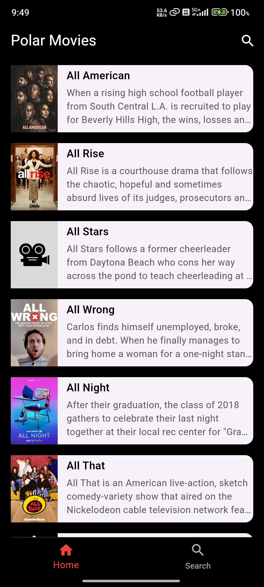

# **Polar Movies 🎥**  
A sleek and modern Flutter application to explore, search, and dive deep into your favorite movies! Designed to mimic the elegance of Netflix, **Polar Movies** is your one-stop app for movie enthusiasts.

---

## **Features 🚀**  
- **Splash Screen**: Welcomes users with a captivating image.  
- **Home Screen**: Displays a list of movies fetched dynamically from the TVmaze API with a thumbnail, title, and summary.  
- **Search Screen**: Allows users to search for any movie using an intuitive search bar.  
- **Details Screen**: Provides in-depth information about the selected movie, including its title, image, summary, and more.  
- **Bottom Navigation Bar**: Seamlessly switch between Home and Search screens.  

---

## **Tech Stack 🛠️**  
- **Flutter**: For building the cross-platform mobile app.  
- **Dart**: The programming language behind Flutter.  
- **HTTP**: For API integration to fetch movie data.  
- **MVC Architecture**: Ensures clean code separation for Models, Views, and Controllers.  

---

## **API Endpoints 🌐**  
- **Fetch All Movies**:  
  `https://api.tvmaze.com/search/shows?q=all`  
- **Search Movies**:  
  `https://api.tvmaze.com/search/shows?q={search_term}`  

---

## **Screenshots 📸**  
Below are screenshots of the app:  

<p align="center">
  
  
  
  
  
</p>  

---

## **How to Run the App 🏃**  
1. Clone this repository:  
   ```bash
   git clone https://github.com/your-repo/polar-movies.git
2. Navigate to the project directory:
   ```bash
   cd polar-movies
3. Install dependencies:
   ```bash
   flutter pub get
4. Run the app:
   ```bash
   flutter run

---

## **Thank You!**

